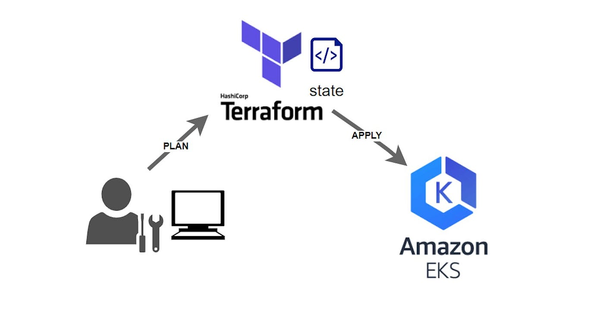

# Deploy EKS using Terraform

<p align="center"></p>

----

This repo provides the Terraform configuration to deploy an AWS EKS cluster. Amazon Elastic Kubernetes Service (Amazon EKS) is a managed Kubernetes service provided by AWS. Terraform is a tool to manage your infrastructure as code so rather than provisioning an EKS cluster manually, you can use terraform to provision them for you.

----

## Prerequisites

##### Install Kubectl

```
curl -O https://s3.us-west-2.amazonaws.com/amazon-eks/1.28.3/2023-11-14/bin/linux/amd64/kubectl
sudo install -o root -g root -m 0755 kubectl /usr/local/bin/kubectl
rm -rf kubectl
```

##### Install AWS CLI

```
curl "https://awscli.amazonaws.com/awscli-exe-linux-x86_64.zip" -o "awscliv2.zip"
unzip awscliv2.zip
sudo ./aws/install
rm -rf awscliv2.zip
rm -rf aws
```

##### Install Terraform

```
TF_VERSION=$(curl -sL https://releases.hashicorp.com/terraform/index.json | jq -r '.versions[].builds[].version' | grep -v 'rc|beta|alpha' | tail -1)

curl -LO "https://releases.hashicorp.com/terraform/${TF_VERSION}/terraform_${TF_VERSION}_linux_amd64.zip"
unzip terraform_${TF_VERSION}_linux_amd64.zip
sudo mv -f terraform /usr/local/bin/
rm terraform_${TF_VERSION}_linux_amd64.zip
```

##### Connect Terraform with AWS

```
aws configure
```

## Create EKS cluster

```
git clone https://github.com/jeromebrasseur/deploy-eks-using-terraform.git
cd deploy-eks-using-terraform
terraform init
terraform plan
terraform apply
```
